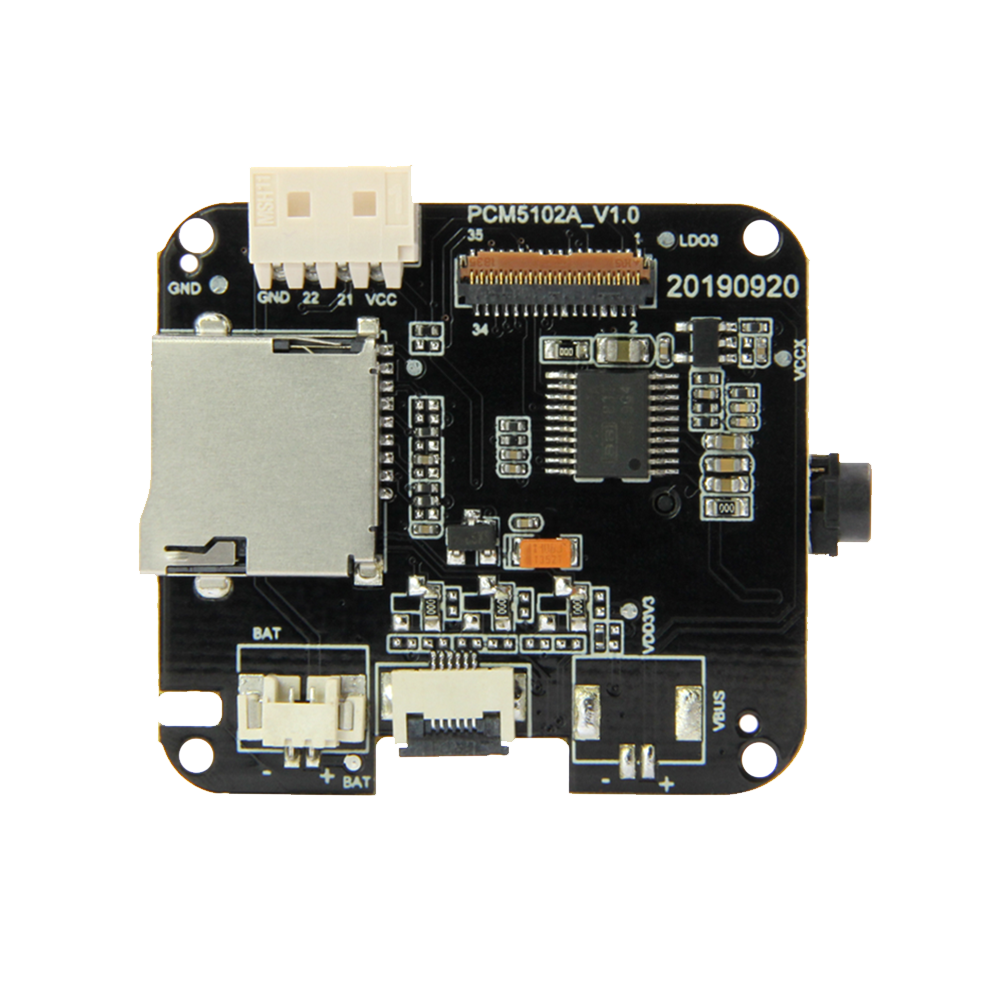
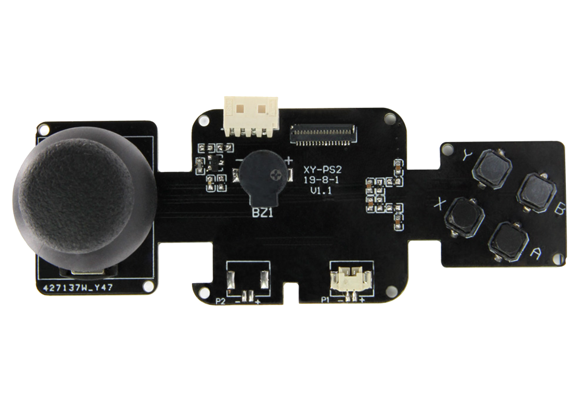
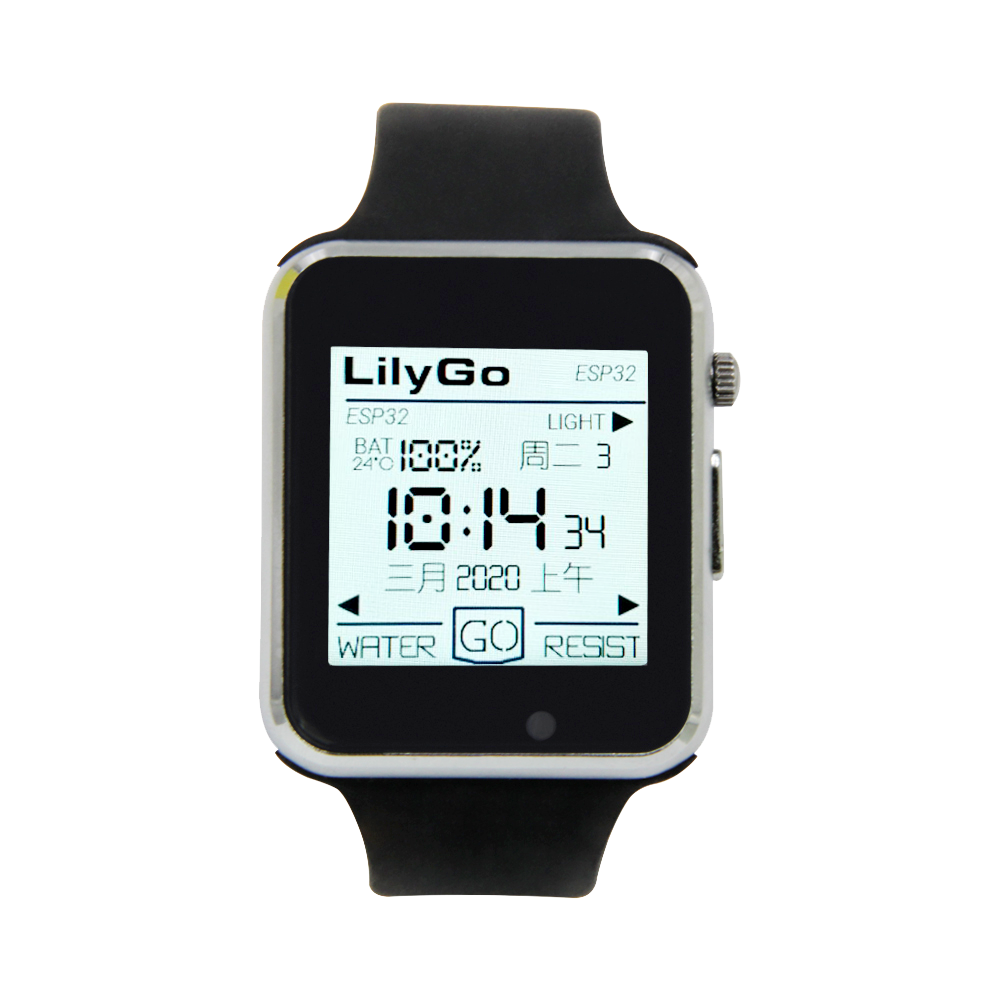
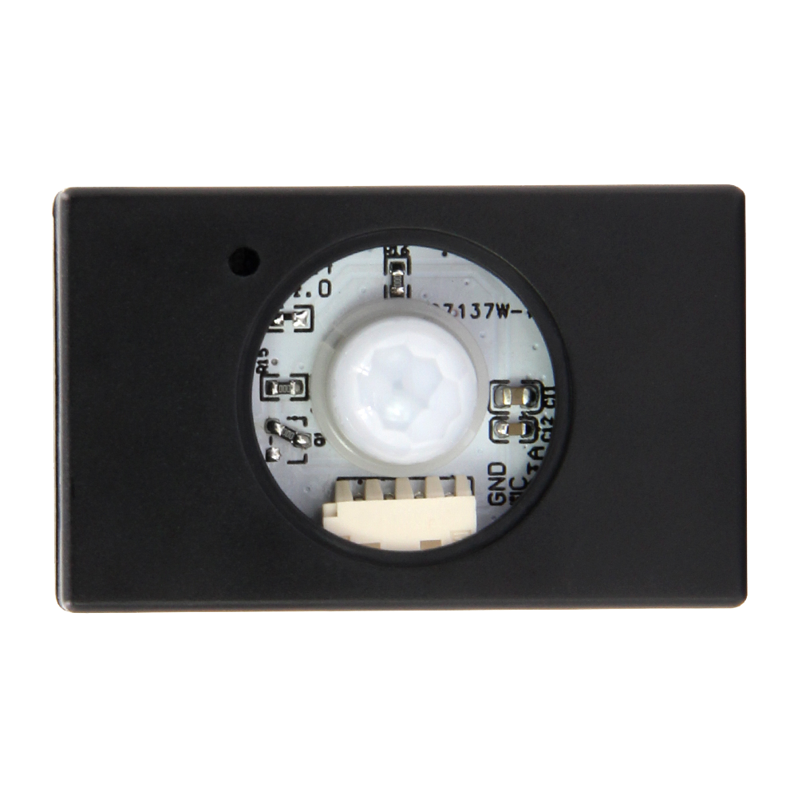
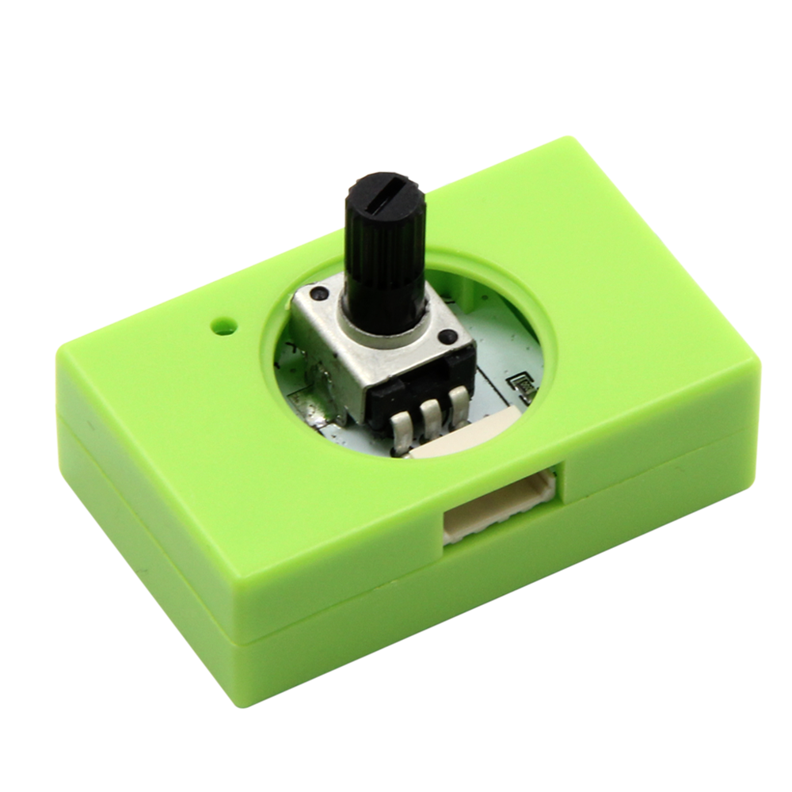
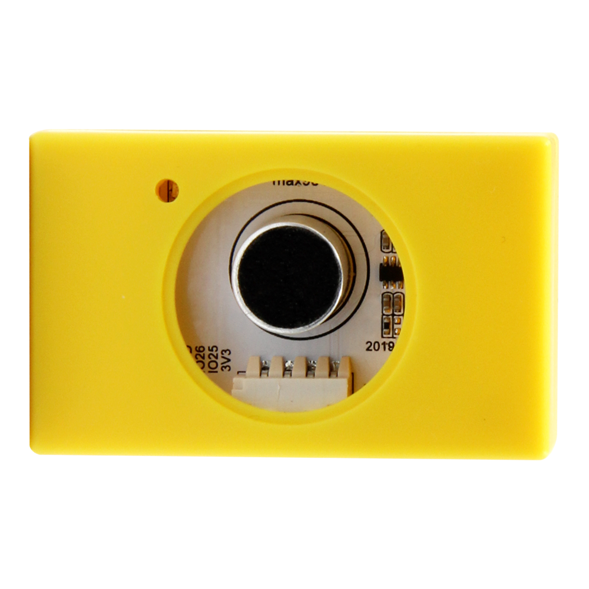
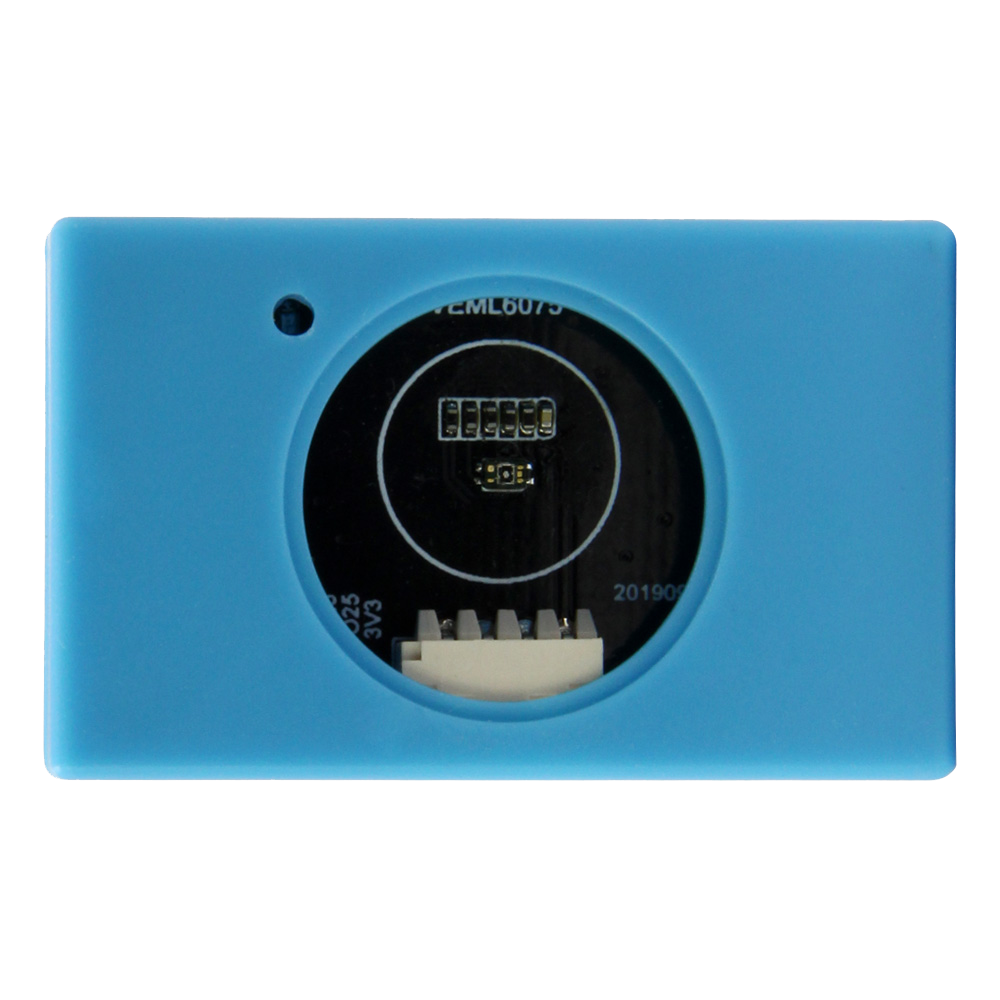
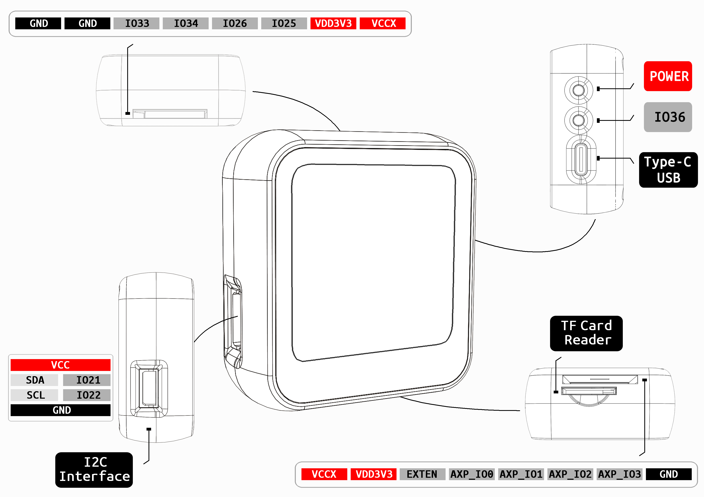

====================
T-Watch Introduction
====================

.. image:: ../_static/image3.jpg

Product Categories
===================

==================  ==================  ==================
|Standard|_           |SIM800L|_         |GPS|_
------------------  ------------------  ------------------
`Standard`_           `SIM800L`_         `GPS`_
------------------  ------------------  ------------------
|MPR121|_              |Lora+GPS|_       |SX1276|_
------------------  ------------------  ------------------
`MPR121`_              `Lora+GPS`_       `SX1276`_
------------------  ------------------  ------------------
|MP3|_                 |Max98357A|_        |Car|_
------------------  ------------------  ------------------
`MP3`_                  `Max98357A`_       `Car`_
------------------  ------------------  ------------------
|Quick_Car|_           |Heart_Rate|_        |NFC|_
------------------  ------------------  ------------------
`Quick_Car`_           `Heart_Rate`_        `NFC`_
------------------  ------------------  ------------------
|Game|_                  |2020|_        |To be continued|_  
------------------  ------------------  ------------------
`Game`_                  `2020`_        `To be continued`_
==================  ==================  ==================

.. |Standard| image:: ../_static/std1.png
.. _Standard: ../introduction/product/standtrd.html

.. |MPR121| image:: ../_static/basic01.png
.. _MPR121: ../introduction/product/mpr4.html

.. |SIM800L| image:: ../_static/SIM02.png
.. _SIM800L: ../introduction/product/sim02.html

.. |GPS| image:: ../_static/GPS3.png
.. _GPS: ../introduction/product/gps8m03.html

.. |Lora+GPS| image:: ../_static/s76g05.png
.. _Lora+GPS: ../introduction/product/s76g05.html

.. |SX1276| image:: ../_static/sx127601.png
.. _SX1276: ../introduction/product/sx127606.html

.. _MP3: ../introduction/product/pcm.html

.. |NFC| image:: ../_static/nfc01.png
.. _NFC: ../introduction/product/nfc.html

.. |Car| image:: ../_static/car01.png
.. _Car: ../introduction/product/car.html

.. |To be continued| image:: ../_static/tobe06.png
.. _To be continued: ../introduction/module/tobe06.html

.. |Quick_Car| image:: ../_static/quick.png
.. _Quick_Car: ../introduction/product/quick.html

.. |Heart_Rate| image:: ../_static/max.png
.. _Heart_Rate: ../introduction/product/heart.html

.. |Max98357A| image:: ../_static/speaker.png
.. _Max98357A: ../introduction/product/speaker.html

.. _Game: ../introduction/product/game.html

.. _2020: ../introduction/product/2020.html

.. toctree::
   :hidden:
   :maxdepth: 2
   :numbered:
   
   Standard <product/standtrd> 
   SIM800L <product/sim02>
   GPS <product/gps8m03>
   MPR121 <product/mpr4>
   Lora+GPS <product/s76g05>
   SX1276 <product/sx127606>
   MP3 <product/pcm>
   Max98357A <product/speaker>
   Car <product/car>
   Quick_Car <product/quick>
   Heart_Rate <product/heart>
   NFC <product/nfc>
   Game <product/game>
   Game <product/2020>

Expansion module
====================

====================  ====================  ====================
  |Button|_             |Buzzer|_               |WS2812_RGB|_
--------------------  --------------------  --------------------
   `Button`_             `Buzzer`_               `WS2812_RGB`_
--------------------  --------------------  --------------------
|DHT12_Sensor|_        |Pir|_                |Photoresistance|_
--------------------  --------------------  --------------------
`DHT12_Sensor`_        `Pir`_                `Photoresistance`_
--------------------  --------------------  --------------------
|Relay|_                |Raindrop|_           |Door_Contact|_
--------------------  --------------------  --------------------
`Relay`_                `Raindrop`_           `Door_Contact`_
--------------------  --------------------  --------------------
|Microphone|_           |Servo|_              |Dou_Function|_
--------------------  --------------------  --------------------
`Microphone`_           `Servo`_              `Dou_Function`_
--------------------  --------------------  --------------------
|IR_Send|_              |IR_Rec|_             |Ultraviolet|_
--------------------  --------------------  --------------------
`IR_Send`_              `IR_Rec`_             `Ultraviolet`_
--------------------  --------------------  --------------------
|Potentiometer|_        |Soil_Moisture|_       |Color|_
--------------------  --------------------  --------------------
`Potentiometer`_        `Soil_Moisture`_       `Color`_
====================  ====================  ====================

.. |Button| image:: ../_static/button1.png
.. _Button: ../introduction/module/button1.html

.. |Buzzer| image:: ../_static/buzzer2.png
.. _Buzzer: ../introduction/module/buzzer2.html

.. |DHT12_Sensor| image:: ../_static/dht3.png
.. _DHT12_Sensor: ../introduction/module/dht3.html

.. |WS2812_RGB| image:: ../_static/rgb4.png
.. _WS2812_RGB: ../introduction/module/rgb4.html

.. _Pir: ../introduction/module/pir5.html

.. |Photoresistance| image:: ../_static/photo6.png
.. _Photoresistance: ../introduction/module/photo6.html

.. |Relay| image:: ../_static/relay7.png
.. _Relay: ../introduction/module/relay7.html

.. |Raindrop| image:: ../_static/raindrop8.png
.. _Raindrop: ../introduction/module/raindrop8.html

.. |Door_Contact| image:: ../_static/door9.png
.. _Door_Contact: ../introduction/module/door9.html

.. _Potentiometer: ../introduction/module/poten10.html

.. |Soil_Moisture| image:: ../_static/soil11.png
.. _Soil_Moisture: ../introduction/module/soil11.html

.. _Microphone: ../introduction/module/mic12.html

.. |Servo| image:: ../_static/servo.png
.. _Servo: ../introduction/module/servo13.html

.. |Dou_Function| image:: ../_static/dou.png
.. _Dou_Function: ../introduction/module/dou14.html

.. |Color| image:: ../_static/color.png
.. _Color: ../introduction/module/color.html

.. |IR_Send| image:: ../_static/send7.png
.. _IR_Send: ../introduction/module/send.html

.. |IR_Rec| image:: ../_static/receive8.png
.. _IR_Rec: ../introduction/module/rec.html

.. _Ultraviolet: ../introduction/module/ultra.html

.. toctree::
   :hidden:
   :maxdepth: 2
   :numbered:
   
   Button <module/button1> 
   Buzzer <module/buzzer2>
   WS2812 <module/rgb4>
   DHT12_Sensor <module/dht3>
   Pir <module/pir5>
   Photoresistance <module/photo6> 
   Relay <module/relay7>
   Raindrop <module/raindrop8>
   Door_Contact <module/door9>
   Microphone <module/mic12>
   Servo <module/servo13>
   Dou_Function <module/dou14>
   Potentiometer <module/poten10>
   Soil_Moisture <module/soil11>
   Color <module/color>
   IR_Send <module/send>
   IR_Rec <module/rec>
   Ultraviolet <module/ultra>

Hardware overview
==================

Category
--------------

* :ref:`technical-parameters`
* :ref:`appearance-specification`
* :ref:`component-layout`
* :ref:`pin-definition`

.. _technical-parameters:

1.Technical Parameters
========================

- T-Watch onboard:

  - 1.54 inch LCD capacitive touch screen: ST7789V
  - Touch screen chip: FT5206
  - Three-axis accelerometer: BMA423
  - PMU Power Management: AXP202
  - RTC clock module: PCF8563

.. figure:: ../_static/get_started2.jpg 
   :scale: 40
   :align: center

- **ESP-32** Master control：

  - Processors:

    - CPU: Xtensa dual-core 32-bit LX6 microprocessor, operating at 240 MHz
    - Ultra low power (ULP) co-processor
  - Memory: 520 KiB SRAM

  - Wireless connectivity:

    - Wi-Fi: 802.11 b/g/n
    - Bluetooth: v4.2 BR/EDR and BLE

  - Power supply：Type-C USB/Lithium battery
  - Operating Voltage：3.3V
.. note::
  
  ESP32 was created and developed by Lexin Information Technology, a Shanghai-based Chinese company, and manufactured by TSMC using 40-nanometer technology.
  It is the successor to the ESP8266 microcontroller.

Boot demo video
-----------------
.. figure:: ../_static/gif4.gif
  :scale: 100
  :align: left

Interface switching video
-----------------------------
.. figure:: ../_static/gif5.gif
  :scale: 100
  :align: left

.. _appearance-specification:

2. Appearance specifications
=============================

.. image:: ../_static/model1.jpg

.. _component-layout:

3. Component layout
=============================

.. image:: ../_static/model3.jpg
.. _pin-definition:

4. Pin definition
=============================

.. image:: ../_static/model4.jpg
