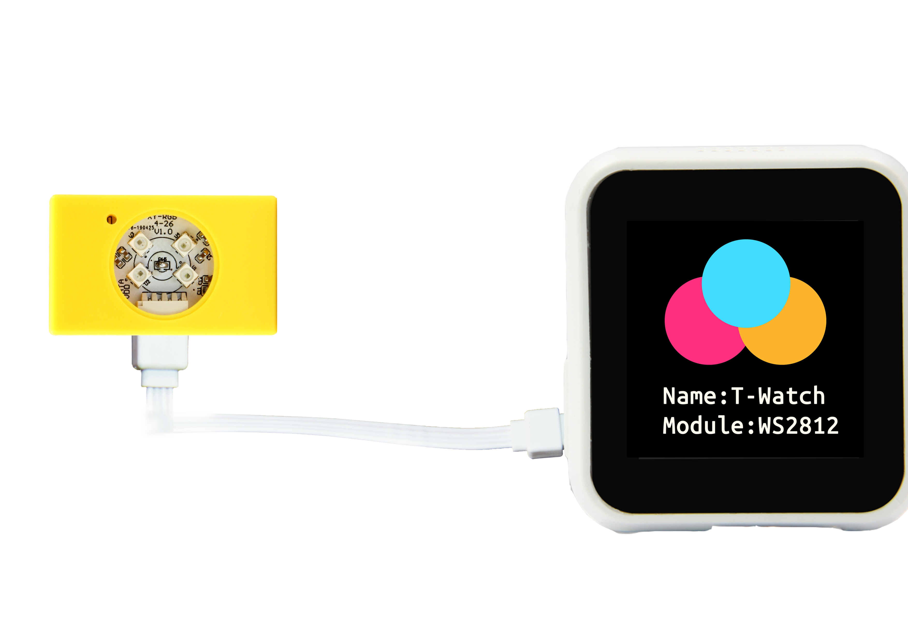

====================
WS2812_RGB
====================

WS2812 Module RGB full-color emits a range of colors by mixing red, green and blue.
The amount of each primary color is adjusted using PWM.

Pin details
+++++++++++++++++
=============== =============  ====================================  
 ESP32           Attributes               Description
=============== =============  ====================================
 GPIO25           1-Wire                  WS2812_RGB
=============== =============  ====================================