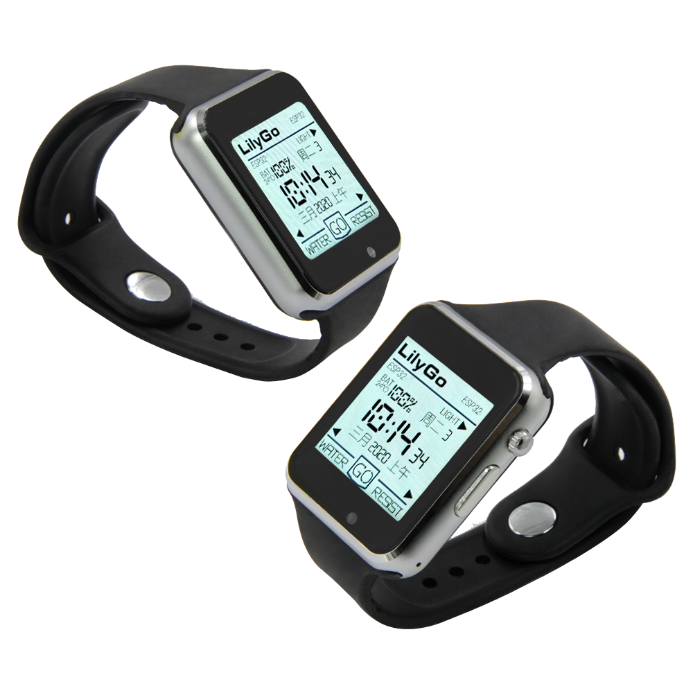

==================
T-Watch 2020
==================

Description
==================

The T-Watch 2020 is an ESP32-based programmable watch.

You can even program the T-Watch 2020 with Arduino, ESP-IDF or MicroPython.

.. image:: ../../_static/model4.jpg

Feature
==================

- Main chip: ESP32, dual core MCU (integrated dual mode Bluetooth/wifi), PMU power management
- Display: 1.54 inch LCD capacitive touch screen
- Sensor: 

    - BMA423 three-axis accelerometer
    - AXP202 PMU(Power Management Unit)
    - MAX98357A I2S PCM input Class D audio amplifier
    - Support RTC, IR, Vibration Motor function

- Combination kit: lithium battery, design open mold, and thick strap, and black and white
- Development platform: ESP-IDF (native SDK), Arduino, Lua, MicroPython, Scratch

Pin details
==================

Display
++++++++++++++++++
=============== ==============  ====================================
 ESP32            Attribute      Description
=============== ==============  ====================================
 GPIO05           CS             TFT_CS
 GPIO18           SCLK           TFT_SCLK
 GPIO19           MOSI           TFT_MOSI
 GPIO27           DC             TFT_DC
 GPIO12           BL             TFT_BL
=============== ==============  ====================================

BMA423
+++++++++++++++++
=============== ==============  ====================================
 ESP32            Attribute      Description
=============== ==============  ====================================
 GPIO21           I2C            PN532_SDA
 GPIO22           I2C            PN532_SCL
 GPIO39           INT            PN532_INT
=============== ==============  ====================================

MAX98357A
+++++++++++++++++
=============== ==============  ====================================
 ESP32            Attribute      Description
=============== ==============  ====================================
 GPIO25           I2S            I2S_WS
 GPIO26           I2S            I2S_BCK
 GPIO33           I2S            I2S_DOUT
=============== ==============  ====================================

AXP202
+++++++++++++++++
=============== ==============  ====================================
 ESP32            Attribute      Description
=============== ==============  ====================================
 GPIO21           I2C            AXP202_SDA
 GPIO22           I2C            AXP202_SCL
 GPIO35           INT            AXP202_INT
=============== ==============  ====================================

Touch
+++++++++++++++++
=============== ==============  ====================================
 ESP32            Attribute      Description
=============== ==============  ====================================
 GPIO23           I2C            I2C_SDA
 GPIO32           I2C            I2C_SCL
 GPIO38           INT            I2C_INT
=============== ==============  ====================================

Motor
+++++++++++++++++
=============== ==============  ====================================
 ESP32            Attribute      Description
=============== ==============  ====================================
 GPIO04           1-Wire          Motor
=============== ==============  ====================================

Vibration Motor
+++++++++++++++++
=============== ==============  ====================================
 ESP32            Attribute      Description
=============== ==============  ====================================
 GPIO04           1-Wire          Motor
=============== ==============  ====================================

IR
+++++++++++++++++
=============== ==============  ====================================
 ESP32            Attribute      Description
=============== ==============  ====================================
 GPIO13          1-Wire          IR
=============== ==============  ====================================

RTC
+++++++++++++++++
=============== ==============  ====================================
 ESP32            Attribute      Description
=============== ==============  ====================================
 GPIO37          1-Wire          RTC
=============== ==============  ====================================

Demo program 
==================

 - `Github Source code <https://github.com/Xinyuan-LilyGO/TTGO-T-Watch>`_