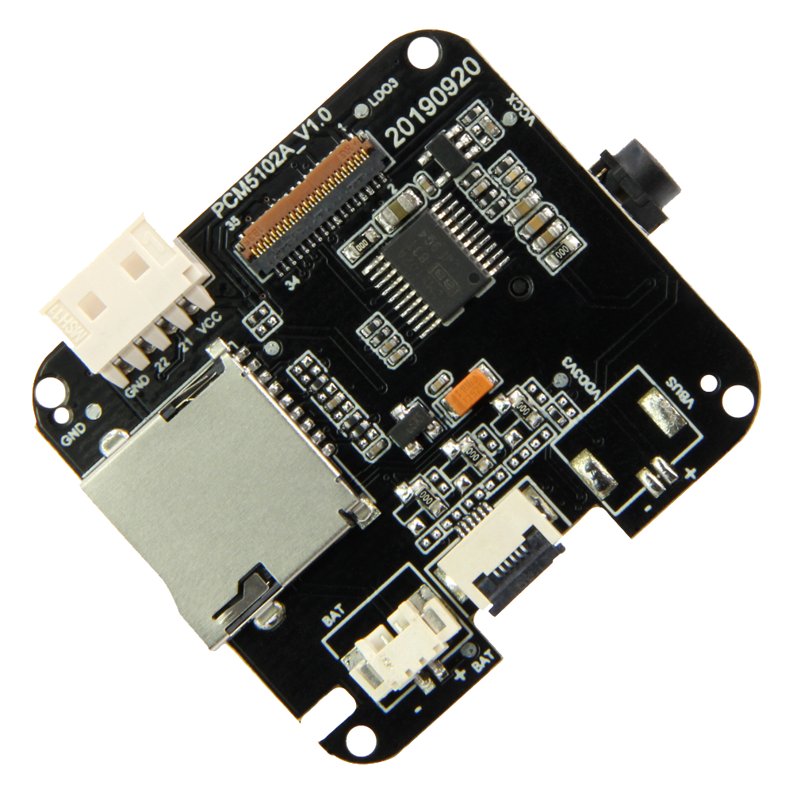

==================
T-Watch PCM5102A
==================

Description
==================

.. image:: ../../_static/model4.jpg

Feature
==================

- Main chip: ESP32, dual core MCU (integrated dual mode Bluetooth/wifi), PMU power management
- Display: 1.54 inch LCD capacitive touch screen
- Sensor: BMA423 three-axis accelerometer, built-in step counting algorithm, activity recognition / tracking, advanced gesture recognition, etc.
- Combination kit: lithium battery, design open mold, and thick strap, and black and white
- Development platform: ESP-IDF (native SDK), Arduino, Lua, MicroPython, Scratch
- Support for expandable module use

Pin details
==================

Display
++++++++++++++++++
=============== ==============  ====================================
 ESP32            Attribute      Description
=============== ==============  ====================================
 GPIO05           CS             TFT_CS
 GPIO18           SCLK           TFT_SCLK
 GPIO19           MOSI           TFT_MOSI
 GPIO27           DC             TFT_DC
 GPIO12           BL             TFT_BL
=============== ==============  ====================================

PCM5102A
+++++++++++++++++
=============== ==============  ====================================
 ESP32            Attribute      Description
=============== ==============  ====================================
 GPIO25           LCK            PCM5102A_LCK 
 GPIO26           BCK            PCM5102A_BCK
 GPIO33           DIN            PCM5102A_DIN
=============== ==============  ====================================

TF Card
+++++++++++++++++
=============== ==============  ====================================
 ESP32            Attribute      Description
=============== ==============  ====================================
 GPIO13          CS               TF_CS
 GPIO15          MOSI             TF_MOSI
 GPIO02          MISO             TF_MISO
 GPIO14          SCLK             TF_SCLK
=============== ==============  ====================================

Demo program 
==================

 - `Github Source code <https://github.com/Xinyuan-LilyGO/twatch-series-modules/blob/master/twatch_s7xg/twatch_s7xg.ino>`_
