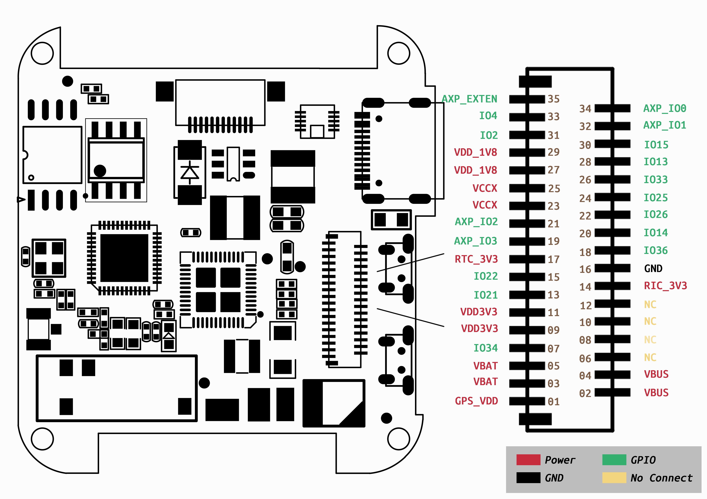

==================
T-Watch SIM800L
==================

.. image:: ../../_static/simcard1.png

Description
==================

The T-Watch SIM800L is an ESP32-based programmable watch kit consisting of a Core PCB and a SIM800L backplane.
You can even program the T-Watch SIM800L with Arduino, ESP-IDF or MicroPython.

Feature
==================

- Main chip: ESP32, dual core MCU (integrated dual mode Bluetooth/wifi), PMU power management
- Display: 1.54 inch LCD capacitive touch screen
- Sensor: BMA423 three-axis accelerometer, built-in step counting algorithm, activity recognition / tracking, advanced gesture recognition, etc.
- Combination kit: lithium battery, design open mold, and thick strap, and black and white
- Development platform: ESP-IDF (native SDK), Arduino, Lua, MicroPython, Scratch
- Support SIM card phone communication function
- Support microphone
- Support speakers
- Support for expandable module use

Pin details
==================

Display
++++++++++++++++++
=============== ==============  ====================================
 ESP32            Attribute      Description
=============== ==============  ====================================
 GPIO05           CS             TFT_CS
 GPIO18           SCLK           TFT_SCLK
 GPIO19           MOSI           TFT_MOSI
 GPIO27           DC             FT_DC
 GPIO12           BL             TFT_BL
=============== ==============  ====================================

SIM800L
+++++++++++++++++
=============== ==============  ====================================
 ESP32            Attribute      Description
=============== ==============  ====================================
 GPIO33          TX              SIM Card,UART_SIM_TX
 GPIO34          RX              SIM Card,UART_SIM_RX
 GPIO14          RST             SIM Card,SIM_RST
 GPIO15          PWKEY           SIM Card,SIM_PWKEY
 GPIO04          BOOST           SIM Card,SIM_BOOST_CTRL
=============== ==============  ====================================

Demo program 
==================
 - `Github Source code <https://github.com/Xinyuan-LilyGO/twatch-series-modules/tree/master/twatch_sim800>`_

